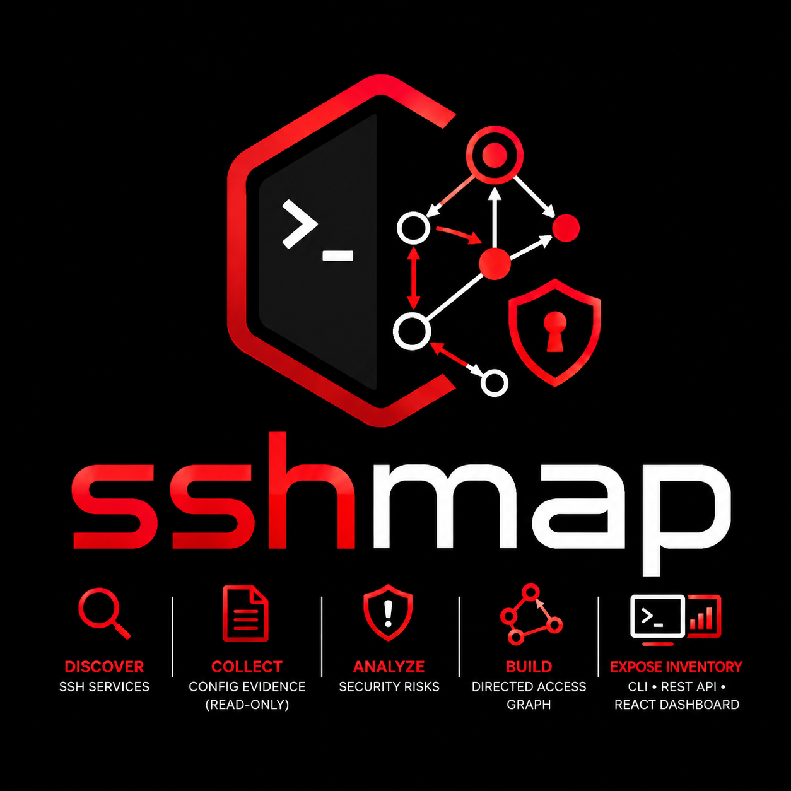

# SSHMap

<p align="center">
  
</p>

SSHMap is an agentless SSH exposure management CLI. It discovers SSH services, collects read-only configuration evidence, analyzes security risks, builds a directed access graph, and exposes inventory through a command-line interface, REST API, and React dashboard.

**Current release:** `1.2.0`  
**License:** [GNU General Public License v3.0 or later](LICENSE) (GPL-3.0-or-later)

## Author

| | |
|---|---|
| **Developer** | Cuma Kurt |
| **Email** | [cumakurt@gmail.com](mailto:cumakurt@gmail.com) |
| **LinkedIn** | [cuma-kurt-34414917](https://www.linkedin.com/in/cuma-kurt-34414917/) |
| **GitHub** | [cumakurt/sshmap](https://github.com/cumakurt/sshmap) |

Run `sshmap` or `sshmap --help` for the full command reference. Use `sshmap <command> --help` for detailed flag documentation on any subcommand.

---

## Table of Contents

- [What SSHMap Does](#what-sshmap-does)
- [Feature Reference](#feature-reference)
- [Safety](#safety)
- [Installation](#installation)
- [Quick Start](#quick-start)
- [Configuration](#configuration)
- [Live Progress](#live-progress)
- [Command Examples](#command-examples)
- [Web Server, API, and Dashboard](#web-server-api-and-dashboard)
- [End-to-End Workflow](#end-to-end-workflow)
- [Documentation Index](#documentation-index)
- [License](#license)

---

## What SSHMap Does

SSHMap answers four practical questions for infrastructure and security teams:

1. **Where is SSH exposed?** — TCP discovery finds open SSH ports and banners without authentication.
2. **What SSH-related configuration exists?** — Authenticated scans and imports collect `sshd_config`, `authorized_keys`, sudoers, PAM/nsswitch, `known_hosts`, `/etc/hosts`, and client `ssh_config` evidence.
3. **What is risky?** — A built-in risk engine flags weak daemon settings, unrestricted keys, key reuse, dangerous sudo rules, Match-block overrides, certificate expiry, PAM weaknesses, combined escalation paths, stale keys, known OpenSSH CVEs, and server host key drift.
4. **How can access spread?** — A directed graph models users, keys, hosts, sudo relationships, and SSH CA trust for path, blast-radius, and key-compromise simulation.

All findings are stored in a local SQLite database. You can query them from the CLI, export reports, compare baselines over time, or serve them through a read-only API.

---

## Feature Reference

Each section below explains **what a feature does**, **when to use it**, and **what it produces**.

### Database (`init`, `db`)

| Command | Purpose |
|---------|---------|
| `sshmap init` | Creates a new SQLite database with the current schema. Use this at the start of every engagement or customer project. |
| `sshmap db migrate` | Applies pending schema migrations to an existing database. Safe to run after upgrades. |
| `sshmap db stats` | Prints row counts for hosts, users, keys, risks, raw evidence, graph edges, aliases, data quality findings, baselines, and exceptions. Use to verify that collection and analysis completed. |

The database is the single source of truth. Discovery, scans, imports, and analysis all write into it; reports, graph tools, and the API read from it.

### Runtime Checks (`doctor`)

`sshmap doctor` validates the local environment before you run discovery or scans:

- OpenSSH client availability and version
- SSH agent socket when `--agent` is configured
- ControlMaster / multiplexing support for connection reuse
- Writable control socket directory
- Known-hosts file permissions when strict host key checking is enabled
- Optional scope file readability

Use doctor in CI, onboarding scripts, or when scan failures suggest a local tooling problem rather than a remote host issue.

### SSH Discovery (`discover`)

**Purpose:** Find which targets expose SSH **without** logging in.

Discovery performs concurrent TCP checks against IP addresses, CIDR ranges, hostnames, or a target file. For each open port it records:

- Target host and port
- Whether SSH appears open
- SSH banner text when available
- Timestamp and source (`discover`)

**When to use:** Network sweeps, asset inventory, or the first phase of an audit before you have credentials.

**Output:** Host rows in the `hosts` table with `ssh_open` and optional `ssh_banner`. No user accounts or keys are collected at this stage.

```bash
sshmap discover --targets 10.10.0.0/24 --ports 22,2222 --concurrency 100 --db sshmap.db
```

Live progress (host:port and completion percentage) is printed to **stderr** when stderr is a terminal. See [Live Progress](#live-progress).

### Authenticated Scan (`scan`)

**Purpose:** Collect read-only SSH security evidence from live hosts using an audit SSH key or agent.

After connecting, SSHMap runs a fixed set of remote commands (passwd, groups, authorized_keys, sshd_config, effective `sshd -T`, sudoers, known_hosts, ssh client config, `/etc/hosts`, `/etc/os-release`, hostname, etc.). Evidence is stored as raw text in `raw_evidence` and linked to host rows.

| Option | What it does |
|--------|----------------|
| `--user` / `--key` | SSH identity for authentication |
| `--users-file` | Repeat collection for multiple SSH usernames with the same key or agent |
| `--agent` | Use `SSH_AUTH_SOCK` instead of a key file |
| `--sudo` | Prefix commands that need root-readable paths with non-interactive sudo |
| `--transport openssh` | Use the system `ssh` client (default); supports ControlMaster connection reuse |
| `--transport native` | Use the in-process russh client when OpenSSH is unavailable |
| `--proxy-jump` / `-J` | Reach targets through one or more bastion hops (OpenSSH and native) |
| `--strict-host-key` | Control host key verification (`yes`, `no`, `accept-new`) |
| `--no-connection-reuse` | Disable OpenSSH ControlMaster per-host multiplexing |
| `--dry-run` | Print planned read-only remote commands per target without connecting or writing evidence |
| `--progress` | Force live progress on stderr (enabled by default on terminals) |

**When to use:** Authorized assessments where you have SSH access and want live, complete evidence.

**Output:** Raw evidence rows per host. Run `sshmap analyze` afterward to parse and score findings.

Private key file **contents** are never stored. Sensitive patterns in collected output (private keys, secret assignments) are redacted before persistence.

### Local Scan (`local-scan`)

**Purpose:** Audit the machine where SSHMap runs **without SSH**.

Local scan executes the same read-only collection commands locally, including `/etc/hosts`, effective `sshd -T`, and OS metadata collection. Useful for bastions, CI runners, or air-gapped analysis workstations.

Use `--sudo` when passwordless sudo is required to read `/etc/ssh`, `/etc/sudoers`, and user home directories.

Live progress reports each evidence type as it is collected (see [Live Progress](#live-progress)).

**Output:** Same raw evidence pipeline as remote scan; host source is recorded as a local collection.

### Offline Import (`import`)

**Purpose:** Load inventory or evidence files when live SSH is impossible or undesirable.

| Import type | Input | What it adds |
|-------------|-------|----------------|
| `ansible` | Ansible INI inventory | Hostname/IP rows |
| `nmap` | Nmap XML | Discovered SSH hosts |
| `csv` | Custom CSV mapping | Host inventory |
| `known-hosts` | `known_hosts` file | Client trust relationships |
| `hosts-file` | `/etc/hosts` style file | Host/IP aliases and inventory hints |
| `sshd-config` | `sshd_config` snippet | Daemon configuration evidence |
| `ssh-config` | SSH client config | Client jump/forward settings |
| `authorized-keys` | `authorized_keys` file | Key-to-user bindings (requires `--user`) |
| `sudoers` | sudoers fragment | Privilege escalation rules |
| `json` | Prior SSHMap JSON report | Host inventory from export |
| `ssh-audit` | ssh-audit JSON report | External SSH daemon findings |
| `lynis` | Lynis report/dat file | External hardening warnings and suggestions |
| `auto` | Any supported evidence or inventory file | Parser is selected from filename and content |
| `bundle` | Directory of evidence files | Imports every auto-detected supported file |

Imports create or update host rows and insert raw evidence. IPv6 targets are supported in bracketed form, e.g. `--host [2001:db8::1]:2222`.

`auto` and `bundle` are useful when evidence comes from mixed file drops. Host-scoped evidence such as `sshd_config`, `ssh_config`, `authorized_keys`, or sudoers still needs `--host`; `authorized_keys` also needs `--user` when it cannot be inferred.

**When to use:** Offline forensics, vendor file drops, or combining scanner output with later analysis.

### Analysis (`analyze`)

**Purpose:** Turn raw evidence into structured tables, risk findings, and the access graph.

The analyzer:

1. Parses passwd, groups, authorized_keys, sshd_config, effective `sshd -T`, sudoers, known_hosts, `/etc/hosts`, OS metadata, and ssh_config
2. Normalizes users, keys, sudo rules, host metadata, and client config entries
3. Runs the risk engine (with optional YAML policy overrides)
4. Applies stored risk exceptions
5. Rebuilds graph edges between hosts, users, keys, and sudo rules
6. Refreshes host aliases and data quality findings
7. Records analysis timestamp for incremental mode

| Flag | What it does |
|------|----------------|
| `--only risks` | Regenerate risks only (skip graph rebuild) |
| `--only graph` | Rebuild graph only (skip risk regeneration) |
| `--risk-policy` | YAML file to disable rules or change severity thresholds |
| `--incremental --only graph` | Skip graph rebuild when no new evidence since last run |

Phase progress (loading evidence, parsing, generating risks, persisting) is printed to stderr on terminals. See [Live Progress](#live-progress).

**When to use:** After every discovery, scan, or import batch.

**Output:** Populated `users`, `public_keys`, `authorized_keys`, `risks`, `graph_edges`, `host_aliases`, `data_quality_findings`, host metadata, and related tables.

### Workflow Orchestration (`workflow run`)

**Purpose:** Run the standard audit chain in one command.

`sshmap workflow run` executes discovery, authenticated scan, analysis, and optional DNS enrichment. It is a wrapper around existing read-only phases, so each phase still records normal scan run history. Phase banners and per-target progress are shown on stderr when running on a terminal.

```bash
sshmap workflow run --file examples/hosts.txt --user audituser --key ~/.ssh/audit_ed25519 \
  --sudo --enrich-dns --reverse-dns --db sshmap.db
```

For lightweight scheduled audits, use `--repeat-every-seconds` with `--repeat-count`.

### Scan Run History (`scan-runs`)

**Purpose:** Inspect recorded discovery, scan, local-scan, and import executions.

| Command | Purpose |
|---------|---------|
| `sshmap scan-runs list` | Show recent run mode, status, timestamps, operator, and summary |
| `sshmap scan-runs show <id-or-uuid>` | Show one run with audit events and JSON summaries |

### Enrichment and Data Quality (`enrich`)

**Purpose:** Improve host identity resolution and surface inventory consistency problems.

| Command | Purpose |
|---------|---------|
| `sshmap enrich dns` | Resolve known hostnames and aliases into IP aliases |
| `sshmap enrich dns --reverse` | Also attempt reverse DNS through `getent hosts` |
| `sshmap enrich cloud --file tags.json` | Apply cloud/CMDB tags to hosts (environment, criticality, provider metadata) |

Host aliases come from `/etc/hosts`, DNS enrichment, and parsed evidence. Low-confidence loopback or special-use aliases are retained as evidence but are not used to create inventory rows automatically.

Data quality findings flag issues that can make analysis ambiguous, such as unnamed hosts, SSH-open hosts without users, or conflicting aliases that point to multiple addresses. These findings are exposed in the dashboard Quality view and the REST API.

### Risk Engine (`risks`, `exceptions`)

**Purpose:** Surface actionable SSH exposure findings with severity, evidence, and remediation text.

Example risk categories:

- Weak `sshd_config` (password auth, root login, forwarding)
- Unrestricted `authorized_keys` entries
- SSH key reuse across hosts or users
- Dangerous sudo rules (NOPASSWD, broad commands)
- Combined critical paths (reused key plus passwordless sudo)
- Risky SSH client config (`StrictHostKeyChecking no`, `ProxyJump` chains)
- Effective SSH daemon drift (`sshd_config` vs `sshd -T`)
- Weak SSH key material (`ssh-dss`, legacy `ssh-rsa`, RSA below 2048 bits)
- Risky daemon directives (`MaxAuthTries`, `PermitUserEnvironment`, `X11Forwarding`)
- Wildcard sudoers command patterns
- SSH certificate expiry and Match-block policy overrides
- PAM stack weaknesses (`nullok`, password-backed sshd PAM)
- Short sudo paths to root (`SUDO_PATH_TO_ROOT`)

| Command | Purpose |
|---------|---------|
| `sshmap risks list` | Filter by severity or risk code |
| `sshmap risks show <id>` | Full detail, evidence, and recommendation |
| `sshmap exceptions add` | Suppress accepted findings (optional expiry, host, user, or key scope) |
| `sshmap exceptions list` | Review active suppressions |
| `sshmap exceptions remove` | Delete an exception |

Exceptions are applied during analysis, not at display time, so suppressed risks do not reappear until the exception expires or is removed.

### Inventory (`host`, `user`, `keys`)

**Purpose:** Browse normalized SSH identity and access data.

| Command | What you get |
|---------|----------------|
| `host list` / `host show` | Hosts with SSH state, user counts, aliases, linked risks |
| `user list` / `user show` | Cross-host user presence, authorized keys, sudo rules, risks |
| `keys list` | All public keys with usage counts |
| `keys reuse` | Keys appearing on multiple hosts or users |
| `keys show` | Key fingerprint, locations, and linked risks |

Use inventory commands for triage before diving into graph path analysis.

### Access Graph (`graph`, `path`, `blast-radius`)

**Purpose:** Model and query how SSH access can flow through your estate.

The graph contains nodes for **hosts**, **users**, **public keys**, and **sudo rules**. Edges describe relationships such as:

```text
HOST_HAS_USER
USER_ON_HOST
PUBLIC_KEY_CAN_LOGIN_TO_USER
PUBLIC_KEY_REUSED_ON_HOST
USER_HAS_SUDO_RULE
SUDO_RULE_APPLIES_TO_HOST
USER_HAS_PASSWORDLESS_SUDO
CLIENT_CONFIG_PROXY_JUMP
SSH_CA_SIGNED_PUBLIC_KEY
SSH_CA_GRANTS_USER_ACCESS
```

| Command | Purpose |
|---------|---------|
| `graph export` | Export JSON, Graphviz DOT, or Cytoscape JSON for visualization |
| `path --from ... --to ...` | Shortest directed path between two graph nodes |
| `path --weighted --from ... --to ...` | Weighted shortest path (NOPASSWD sudo and key edges prioritized) |
| `paths --from ... --to ...` | Enumerate multiple directed paths (limit configurable) |
| `blast-radius --user ...` | All hosts, keys, and passwordless-sudo targets reachable from a username |
| `key-blast-radius --fingerprint SHA256:...` | Compromise simulation from a public key fingerprint |
| `--full-graph` on path / paths / blast-radius / key-blast-radius | Raise the analysis edge cap from 10,000 to 100,000 for large inventories |

Node references use `type:value` syntax, e.g. `host:web01`, `user:deploy@web01`, `key:SHA256:...`.

Graph path and blast-radius analysis load up to **10,000 edges** by default (CLI and API). Responses include `edges_truncated` when the inventory exceeds the cap. Use `--full-graph` on CLI commands or set `SSHMAP_GRAPH_EDGE_LIMIT` on the server for larger graphs.

**When to use:** Lateral movement analysis, key compromise impact, or explaining access chains to stakeholders.

### Baselines and Drift (`baseline`, `diff`)

**Purpose:** Track how risk posture changes over time.

| Command | Purpose |
|---------|---------|
| `baseline create --name <name>` | Snapshot current risks (signatures, severity, targets) |
| `baseline list` | List saved baselines |
| `diff --from <name> --to latest` | New, resolved, and unchanged risks since baseline |
| `diff --from <a> --to <b>` | Compare any two baselines |
| `diff --evidence --host <target>` | Compare raw evidence drift between scan runs |

Use baselines after initial audit and after remediation sprints to prove progress. Use evidence drift to detect configuration changes before new risks appear.

### Context-Aware Risk Scoring

During `sshmap analyze`, severity and score are adjusted using host `environment`, `criticality`, `ssh_open`, and OS metadata. Production-exposed hosts escalate findings such as password authentication.

### Server Host Key Inventory

Discovery records SSH server host key fingerprints (when `ssh-keyscan` is available) and flags key changes or cross-host key conflicts.

### OpenSSH CVE Correlation

Discovery banners are parsed for OpenSSH versions and matched against an embedded offline CVE rule set (`SSH_OPENSSH_KNOWN_CVE`).

### Key Rotation Policy

Stale and never-rotated widely deployed keys produce `SSH_KEY_STALE` and `SSH_KEY_NEVER_ROTATED` findings. Tune age threshold with `SSH_KEY_STALE.high_threshold` in risk policy.

### Compliance Mapping (`compliance`)

Maps open risk codes to CIS and STIG SSH control catalogs. Use `all` to include every framework, or filter with `CIS` or `STIG`.

```bash
sshmap compliance report --framework CIS --db sshmap.db
sshmap compliance report --framework all --json --db sshmap.db
```

The REST API exposes the same report at `GET /api/compliance?framework=CIS`. Framework values are length-limited and restricted to alphanumeric characters, hyphen, and underscore.

### v1.2.0 Automation and Integrations

| Feature | Command / API | Purpose |
|---------|---------------|---------|
| Webhook alerting | `sshmap watch --webhook-url URL` | Periodic analyze cycles with optional baseline drift in webhook payload; webhook failures are logged and do not stop the watch loop |
| SARIF export | `sshmap export sarif` | SARIF 2.1.0 for GitHub Code Scanning and CI gates |
| Remediation export | `sshmap export remediation --format ansible\|shell` | Bulk Ansible playbook or shell script snippets from open risks |
| Evidence audit bundle | `sshmap export bundle --output audit.zip` | ZIP manifest with hosts, risks, optional raw evidence |
| Host hardening score | `sshmap hardening report` / `GET /api/hardening` | Per-host 0–100 score from risks and compliance |
| PAM / nsswitch collection | Included in `scan` | Collects `/etc/pam.d/sshd`, `common-auth`, `nsswitch.conf` |
| Match block risks | Automatic in `analyze` | Flags risky `Match` overrides (root login, password auth) |
| Certificate expiry risks | Automatic in `analyze` | `SSH_CERTIFICATE_EXPIRED` / `SSH_CERTIFICATE_EXPIRING_SOON` |
| Sudo path-to-root | Automatic in `analyze` | `SUDO_PATH_TO_ROOT` for NOPASSWD shell escalation binaries |
| Bastion reachability edges | Automatic when scanning via `--proxy-jump` | `BASTION_REACHABILITY` graph edges |
| Scoped API tokens | `serve --read-token read:... --write-token write:...` | Separate read vs write API credentials |
| Read-only manifest CI test | `cargo test remote_command_manifest_is_read_only` | Guards remote command allowlist in unit tests |
| Graph edge limits | `--full-graph` / `SSHMAP_GRAPH_EDGE_LIMIT` | Bounded path and blast-radius analysis (default 10,000 edges) |
| Dependency audit | `cargo audit` in CI | Tracks advisories; see `scripts/check-rustsec-rsa.sh` for native transport |

```bash
sshmap watch --interval 3600 --webhook-url https://hooks.example.com/sshmap --baseline weekly --db sshmap.db
sshmap export sarif --output findings.sarif.json --db sshmap.db
sshmap export remediation --format ansible --output remediation.yml --db sshmap.db
sshmap export bundle --output audit-bundle.zip --include-raw-evidence --db sshmap.db
sshmap hardening report --json --db sshmap.db
sshmap serve --read-token read:secret --write-token write:secret --allow-write-api --db sshmap.db
```

### Multi-Database Merge (`merge`)

```bash
sshmap merge --from region-a.db --from region-b.db --output central.db
```

### Reports and Exports (`report`, `export`)

**Purpose:** Deliver findings to humans and automation.

| Command | Output |
|---------|--------|
| `report create --format json` | Single JSON document with hosts, users, keys, risks, graph |
| `report create --format html` | Self-contained HTML report |
| `report create --format csv` | Directory of CSV files per entity type |
| `export summary` | Compact JSON stats for dashboards |
| `export risks` | JSON or NDJSON risk stream |
| `export hosts` / `known-hosts` / `ssh-config` | Filtered CSV or JSON slices |
| `export sarif` | SARIF 2.1.0 JSON for CI and code scanning platforms |
| `export remediation` | Ansible playbook or shell remediation script |
| `export bundle` | ZIP audit bundle (manifest, hosts, risks, optional raw evidence) |

### Performance Benchmarks (`bench`)

**Purpose:** Measure analyze, report, and graph performance on a seeded database; enforce CI regression thresholds.

```bash
sshmap bench --seed --hosts 25 --iterations 3 --thresholds benchmarks/ci-thresholds.json --db bench.db
```

Use in release pipelines to catch performance regressions.

### Read-Only Server (`serve`)

**Purpose:** Expose the SQLite inventory over HTTP for dashboards and integrations.

- Opens the database in **read-only** mode
- Serves JSON REST endpoints under `/api/*`
- Optional embedded HTML dashboard or React build from `dashboard/dist`
- Optional `--token`, `--read-token`, or `--write-token` authentication (`X-SSHMap-Token` header, constant-time compare); required on non-loopback binds
- Set `SSHMAP_REQUIRE_TOKEN=1` or pass `--require-token` to require tokens even on loopback
- Read endpoints use a SQLite read-only connection pool; write routes open the database for mutations
- Rate limiting on `/api/*` (20 req/s, burst 40 per client IP)
- `--allow-write-api` enables baseline/exception writes; write routes require the write-scoped token when tokens are split

See [Web Server, API, and Dashboard](#web-server-api-and-dashboard) for endpoint list. Security boundaries are documented in [SECURITY.md](SECURITY.md).

### Shell Completion (`completion`)

Generates bash or zsh completion scripts for faster CLI usage:

```bash
sshmap completion --shell bash > ~/.local/share/bash-completion/completions/sshmap
```

---

## Safety

Only use SSHMap against systems you own or are explicitly authorized to assess.

SSHMap supports read-only inspection through the system OpenSSH client or the built-in native transport. It does not brute force, exploit, or attempt password login. An authorization notice is printed before discovery, scan, and local-scan commands.

Webhook URLs are validated (HTTPS required except loopback HTTP), DNS is resolved and pinned per request, redirects are disabled, and URL credentials are stripped before outbound delivery. Import host identifiers are validated before evidence is stored. The `watch` command logs webhook delivery failures and continues scheduled analysis cycles.

See [SECURITY.md](SECURITY.md) for API authentication, native transport dependency notes, and reporting security issues.

---

## Installation

The repository includes an `install.sh` installer with a guided, step-by-step setup:

1. Detect operating system and package manager
2. Check required dependencies (OpenSSH, curl, compiler, SQLite, Rust)
3. Install only missing OS packages for your distribution
4. Install Rust via rustup when `cargo` is not present
5. Build the release binary and install it to `~/.local/bin`
6. Update your shell `PATH` so `sshmap` is available immediately

```bash
./install.sh          # interactive install
./install.sh -y       # non-interactive (package managers)
./install.sh --dry-run
```

Supported package managers:

```text
apt, dnf, yum, pacman, zypper, apk, brew
```

After installation, open a new terminal or `source ~/.bashrc` / `source ~/.zshrc`, then:

```bash
sshmap doctor
sshmap init --db sshmap.db
sshmap doctor --db sshmap.db --config examples/sshmap.yaml --scope examples/hosts.txt
```

See `docs/doctor.md` for the full check list.

---

## Quick Start

```bash
sshmap init --db sshmap.db
sshmap doctor
sshmap db stats --db sshmap.db

sshmap discover --targets 127.0.0.1 --ports 22 --db sshmap.db

sshmap analyze --db sshmap.db
sshmap risks list --db sshmap.db

sshmap graph export --format dot --output graph.dot --db sshmap.db
sshmap baseline create --name initial --db sshmap.db
```

---

## Configuration

Load shared defaults from YAML:

```bash
sshmap --config examples/sshmap.yaml scan --file hosts.txt --db sshmap.db
```

See `examples/sshmap.yaml` for scan, discover, serve, and database defaults.

---

## Live Progress

Long-running commands print **live status to stderr** when stderr is an interactive terminal (stdout stays clean for piping and scripts).

| Command | What you see |
|---------|----------------|
| `discover` | `discover: 42/100 (42%) 10.0.0.5:22` — updates on the same line |
| `scan` | `scan: 15/50 (30%) web01.example.com:22` |
| `workflow run` | Phase banners (`discovery`, `scan`, `analyze`) plus per-target progress in each phase |
| `analyze` | Phase steps: loading evidence, parsing, generating risks, persisting |
| `local-scan` | Current evidence type (`passwd`, `sshd_config`, …) |
| `watch` | Analyze phase progress on each scheduled cycle; webhook errors are logged without stopping the loop |

**Defaults:** Progress is on when stderr is a TTY. Disable globally with `--no-progress`. Force on in non-TTY environments (CI logs, redirected stderr) with `--progress` on `discover`, `scan`, or `workflow run`.

```bash
# Default: live progress on an interactive terminal
sshmap discover --targets 10.10.0.0/24 --db sshmap.db

# Disable progress (quiet batch jobs)
sshmap --no-progress scan --file hosts.txt --user audit --key ~/.ssh/id_ed25519 --db sshmap.db

# Force progress in CI or when stderr is redirected
sshmap scan --progress --file hosts.txt --user audit --key ~/.ssh/id_ed25519 --db sshmap.db 2>scan.log
```

Progress uses carriage-return line updates on terminals and periodic line logs when stderr is not a TTY.

---

## Command Examples

### Discovery

```bash
sshmap discover --targets 10.10.0.0/24 --ports 22 --concurrency 100 --db sshmap.db
sshmap discover --file examples/hosts.txt --ports 22,2222 --progress --db sshmap.db
```

### Authenticated Scan

```bash
sshmap scan --file examples/hosts.txt --user audituser --key ~/.ssh/audit_ed25519 --db sshmap.db

sshmap scan --file examples/hosts.txt --user audituser --key ~/.ssh/audit_ed25519 \
  --proxy-jump bastion.example.com --transport native --db sshmap.db

sshmap scan --targets 10.10.0.0/24 --user audituser --key ~/.ssh/audit_ed25519 --sudo --db sshmap.db
sshmap scan --file examples/hosts.txt --users-file audit-users.txt --agent --db sshmap.db
sshmap scan --dry-run --file examples/hosts.txt --user audituser --key ~/.ssh/audit_ed25519 --db sshmap.db
```

### Workflow Run

```bash
sshmap workflow run --file examples/hosts.txt --user audituser --key ~/.ssh/audit_ed25519 \
  --sudo --enrich-dns --reverse-dns --db sshmap.db
sshmap scan-runs list --db sshmap.db
sshmap scan-runs show 1 --db sshmap.db
```

### Offline Import

```bash
sshmap import ansible --file inventory.ini --db sshmap.db
sshmap import hosts-file --file /etc/hosts --db sshmap.db
sshmap import auto --file evidence/sshd_config --host web01 --db sshmap.db
sshmap import bundle --dir evidence-drop --host web01 --user deploy --db sshmap.db
sshmap import sshd-config --file sshd_config --host web01 --db sshmap.db
sshmap import authorized-keys --file authorized_keys --host web01 --user deploy --db sshmap.db
sshmap import ssh-audit --file ssh-audit.json --host web01 --db sshmap.db
sshmap import lynis --file lynis-report.dat --host web01 --db sshmap.db
sshmap analyze --db sshmap.db
```

### Enrichment and Data Quality

```bash
sshmap enrich dns --db sshmap.db
sshmap enrich dns --reverse --limit 500 --db sshmap.db
sshmap enrich cloud --file examples/cloud-tags.json --db sshmap.db
sshmap db stats --db sshmap.db
```

### Analysis and Risks

```bash
sshmap analyze --db sshmap.db --risk-policy examples/risk-policy.yaml
sshmap analyze --only risks --db sshmap.db
sshmap analyze --incremental --only graph --db sshmap.db

sshmap risks list --severity critical --db sshmap.db
sshmap exceptions add --code SSH_PASSWORD_AUTH_ENABLED --host-id 1 --reason "legacy" --db sshmap.db
```

### Graph and Path Analysis

```bash
sshmap keys list --db sshmap.db
sshmap path --from key:SHA256:exampleFingerprint --to host:web01 --db sshmap.db
sshmap paths --from user:deploy --to host:db01 --limit 5 --db sshmap.db
sshmap key-blast-radius --fingerprint SHA256:exampleFingerprint --db sshmap.db
sshmap blast-radius --user deploy --db sshmap.db
sshmap diff --evidence --host web01 --db sshmap.db
sshmap compliance report --framework CIS --db sshmap.db
sshmap merge --from region-a.db --from region-b.db --output central.db
```

### Reports and Exports

```bash
sshmap report create --format html --output report.html --db sshmap.db
sshmap export summary --output summary.json --db sshmap.db
sshmap export sarif --output findings.sarif.json --db sshmap.db
sshmap export remediation --format ansible --output remediation.yml --db sshmap.db
sshmap export bundle --output audit-bundle.zip --include-raw-evidence --db sshmap.db
```

### Hardening and Scheduled Analysis

```bash
sshmap hardening report --json --db sshmap.db
sshmap watch --interval 3600 --webhook-url https://hooks.example.com/sshmap --baseline weekly --db sshmap.db
```

---

## Web Server, API, and Dashboard

Embedded dashboard:

```bash
sshmap serve --db sshmap.db --listen 127.0.0.1:8080 --read-only
```

React dashboard (detail pages, filters, Quality view, Operations metrics, baseline risk trend, compliance summary, graph canvas with limit and edge filters):

```bash
cd dashboard && npm ci && npm run build
sshmap serve --db sshmap.db --listen 127.0.0.1:8080 --read-only --dashboard dashboard/dist
```

Dashboard tests (Vitest unit tests + shell E2E smoke against the built bundle):

```bash
cd dashboard && npm test && npm run test:e2e
```

Optional browser E2E with Playwright: `npm run test:e2e:playwright` (requires Chromium).

API token (required on non-loopback addresses; optional on loopback unless `SSHMAP_REQUIRE_TOKEN=1`):

```bash
sshmap serve --db sshmap.db --listen 127.0.0.1:8080 --read-only --token "$SSHMAP_TOKEN"
sshmap serve --db sshmap.db --listen 127.0.0.1:8080 --read-only --require-token --token "$SSHMAP_TOKEN"
```

Send the token in the `X-SSHMap-Token` header. The React dashboard stores it in browser local storage from the Tools page. `/health` is unauthenticated; `/api/*` routes are rate-limited per client IP. Graph analysis endpoints load up to **10,000 edges** by default (same as CLI); override with `SSHMAP_GRAPH_EDGE_LIMIT` on the server or `--full-graph` on CLI path commands.

Write API endpoints are disabled by default. To create baselines or exceptions through HTTP, start the server with an explicit token and `--allow-write-api`:

```bash
sshmap serve --db sshmap.db --listen 127.0.0.1:8080 --read-only \
  --token "$SSHMAP_TOKEN" --allow-write-api
```

Split read and write credentials when integrations should not mutate inventory:

```bash
sshmap serve --db sshmap.db --listen 127.0.0.1:8080 --read-only \
  --read-token "read:$SSHMAP_READ_TOKEN" \
  --write-token "write:$SSHMAP_WRITE_TOKEN" \
  --allow-write-api
```

Core API endpoints:

```text
GET /api/summary
GET /api/hosts?ssh_open=&source=&q=&limit=
GET /api/hosts/{id}
GET /api/users?q=&min_hosts=&min_risks=&limit=
GET /api/users/{username}
GET /api/keys
GET /api/keys/reuse
GET /api/keys/{target}
GET /api/risks?severity=&code=&limit=
GET /api/risks/{id}
GET /api/graph?limit=
GET /api/path?from=...&to=...
GET /api/blast-radius?user=...
GET /api/scan-runs?limit=
GET /api/scan-runs/{id-or-uuid}
GET /api/baselines
GET /api/diff?from=...&to=latest
GET /api/exceptions
GET /api/known-hosts
GET /api/ssh-config
GET /api/host-aliases
GET /api/data-quality
GET /api/remediation/{code}
GET /api/compliance?framework=
GET /api/operations-metrics
GET /api/paths?from=...&to=...&limit=
GET /api/key-blast-radius?fingerprint=
GET /api/hardening
POST /api/baselines
POST /api/exceptions
DELETE /api/exceptions/{id}
```

See `docs/api.md` and `docs/dashboard.md` for full reference.

### API migration (v1.2.0)

Breaking response shape changes for dashboard and automation clients:

- `GET /api/graph` returns `{ edges, truncated, total_edges, edge_limit }` instead of a bare edge array.
- `GET /api/hardening` returns `{ hosts, summary, control_count }` instead of a bare host score array.
- Path and blast-radius analysis responses include `edges_truncated` when the graph edge cap is hit.

See `CHANGELOG.md` for details.

Graph analysis uses a default cap of **10,000 edges** (CLI and API). Use `--full-graph` on `path`, `paths`, `blast-radius`, and `key-blast-radius` for up to 100,000 edges, or set `SSHMAP_GRAPH_EDGE_LIMIT` on the server.

---

## End-to-End Workflow

```bash
sshmap init --db customer.db

sshmap discover --file examples/hosts.txt --ports 22 --concurrency 100 --db customer.db

sshmap scan --file examples/hosts.txt --user audituser --key ~/.ssh/audit_ed25519 \
  --sudo --timeout 10 --concurrency 20 --db customer.db
# Live progress appears on stderr during discover and scan when running in a terminal

sshmap scan-runs list --db customer.db
sshmap analyze --db customer.db
sshmap enrich dns --reverse --db customer.db

sshmap risks list --severity critical --db customer.db
sshmap keys reuse --db customer.db
sshmap graph export --format dot --output customer-graph.dot --db customer.db
sshmap path --from key:SHA256:exampleFingerprint --to host:web01 --db customer.db
sshmap path --from user:deploy@web01 --to host:web02 --full-graph --db customer.db

sshmap baseline create --name customer-initial --db customer.db
sshmap diff --from customer-initial --to latest --db customer.db

sshmap report create --format html --output customer-report.html --db customer.db
```

---

## Documentation Index

```text
CHANGELOG.md
SECURITY.md
docs/getting-started.md
docs/scope.md
docs/discovery.md
docs/authenticated-scan.md
docs/local-scan.md
docs/importers.md
docs/reports.md
docs/remediation.md
docs/integrations.md
docs/packaging.md
docs/doctor.md
docs/dashboard.md
docs/api.md
docs/benchmarks.md
docs/architecture.md
docs/development/
```

Start with `docs/getting-started.md` and `docs/architecture.md`. API breaking changes in v1.2.0 are summarized in [CHANGELOG.md](CHANGELOG.md) and the [API migration](#api-migration-v120) section above.

The SQLite layer lives under `src/db/` (`pool`, `migrations`, `graph`, `store` modules). Run `cargo test`, `cargo clippy --all-targets -- -D warnings`, and `cargo audit` before releases.

---

## License

SSHMap is free software licensed under the **GNU General Public License v3.0 or later**.

Copyright (C) 2026 Cuma Kurt

You may redistribute and modify SSHMap under the terms of the GPL. See [LICENSE](LICENSE) for the full notice.
